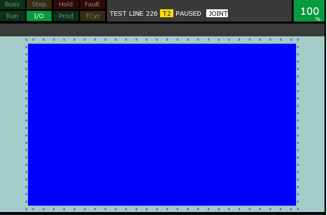

# Backdate Software GmbH
Welcome to the home of Backdate Software **@github**.




This is about Fanuc robots and robot programming.

- TP
- Karel
- HMI HTML/JS/ActiveX)


## Github repositories

### TP-Tools (beta)
A set of FREE tools for your fanuc robot.

**open beta from the beginning of august**

[TP-Tools-Info](./tp-tools-info.md)

[TP-Tools-Repo](https://github.com/Backdate/TP-Tools)  (currently private repo)


---
#### This page/repo

[repo: https://github.com/Backdate/backdate.github.io](https://github.com/Backdate/backdate.github.io)

[website : backdate.github.io/](https://backdate.github.io/)

---

## Company Website (external)

<a href="https://backdate.de/" target="_blank">https://backdate.de/</a>

---

## Imprint
```
Backdate Software GmbH
Ammeloe 82
48691 Vreden
```

### Represented by

Dipl. Ing. (FH) Andreas Wissing

### Contact

```
mail: a.wissing@backdate.de
```

### Register entry

```
HRB16876
```

### Sales tax ID

```
DE312130081
```
